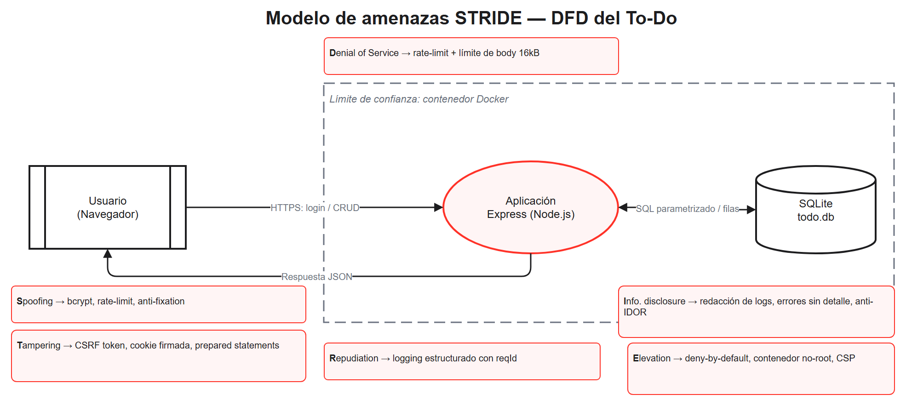
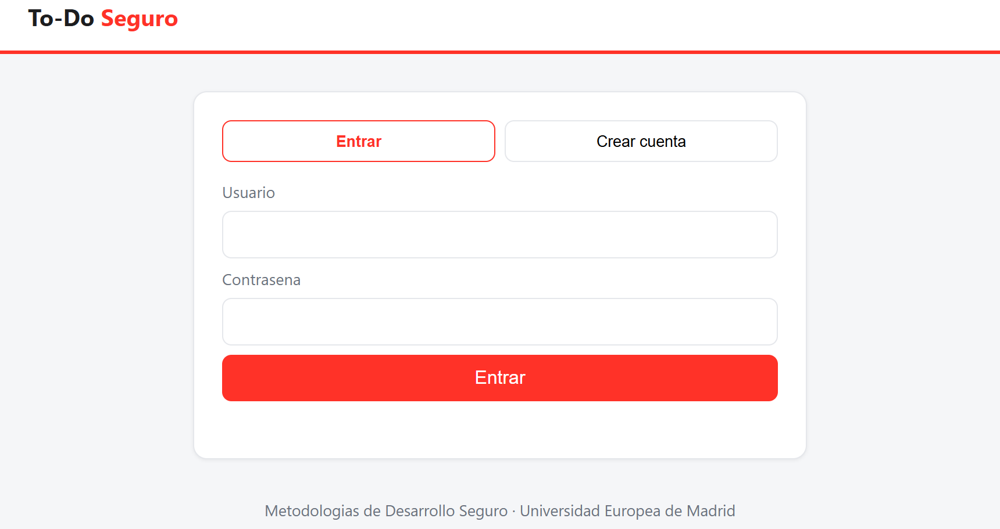
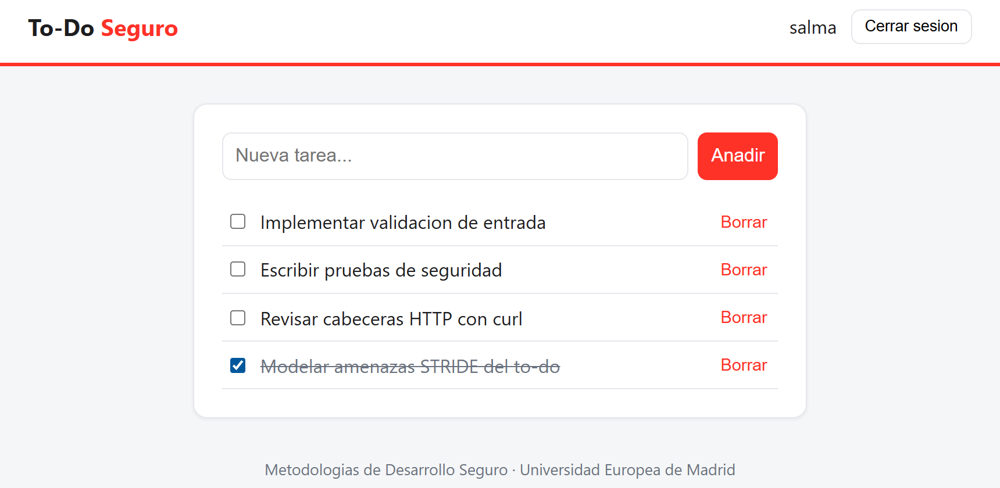
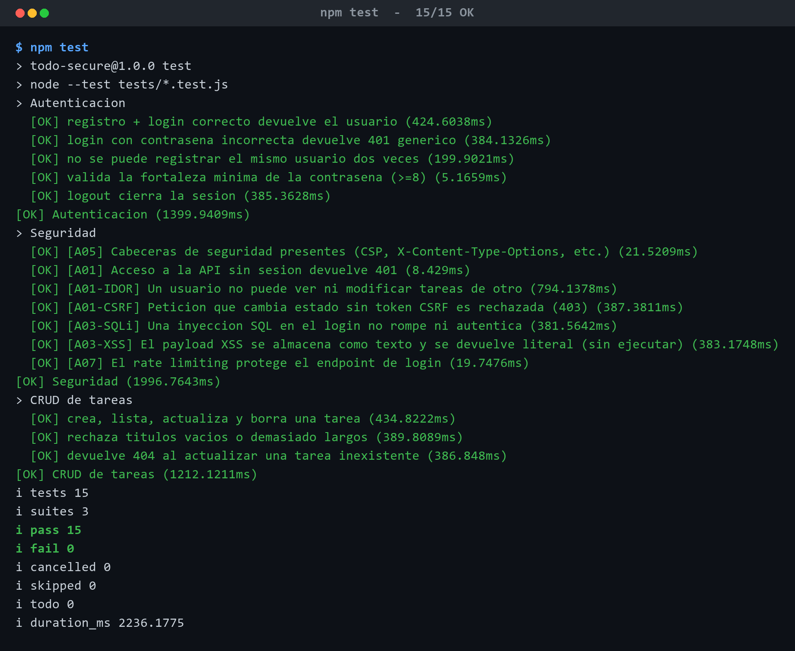
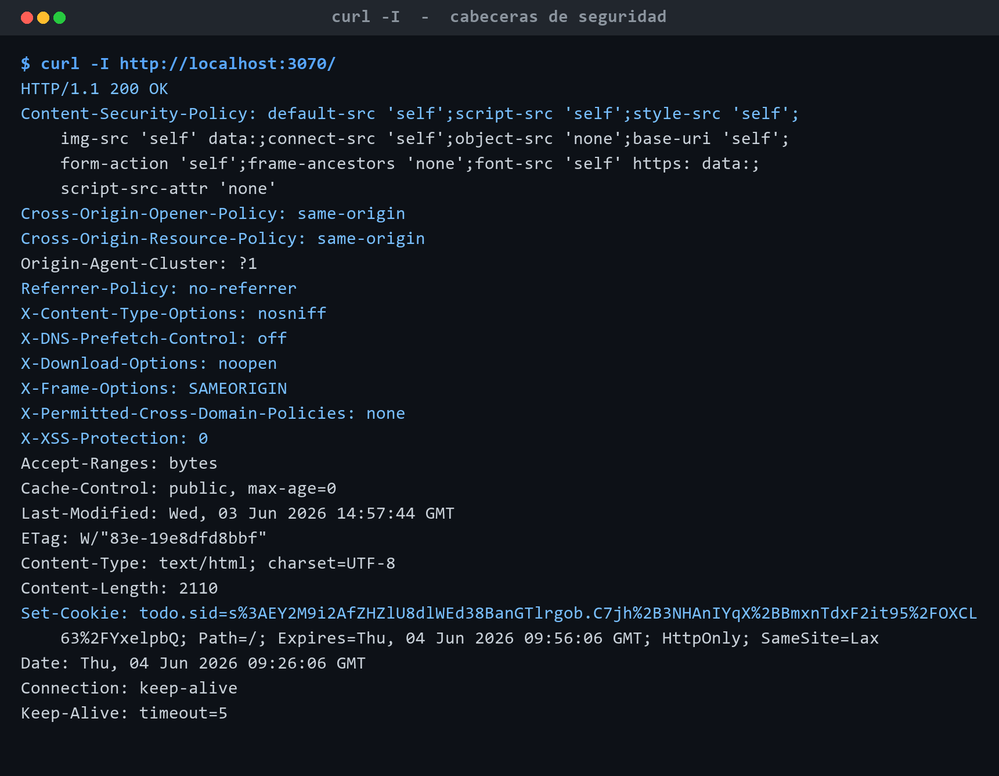

<p align="center">
  
</p>

<h1 align="center">To-Do Seguro</h1>

<p align="center">
  Aplicación web <em>to-do</em> contenerizada, construida siguiendo el
  <strong>Ciclo de Vida de Desarrollo Seguro (S-SDLC)</strong>.
</p>

<p align="center">
  <strong>Asignatura:</strong> Metodologías de Desarrollo Seguro ·
  Grado en Ingeniería de la Ciberseguridad<br/>
  <strong>Universidad Europea de Madrid</strong> · Curso 2025/2026<br/>
  <strong>Estudiante:</strong> Salma Gamal · <strong>Profesor:</strong> Sergio Iglesias Pérez
</p>

---

## Índice

1. [Definición de la aplicación y cómo ejecutarla](#1-definición-de-la-aplicación-y-cómo-ejecutarla-b)
2. [Consideraciones de seguridad realizadas durante el diseño](#2-consideraciones-de-seguridad-realizadas-durante-el-diseño-c)
3. [Paso a paso: cómo crear la aplicación siguiendo el S-SDLC](#3-paso-a-paso-cómo-crear-la-aplicación-siguiendo-el-s-sdlc-d)
4. [Estructura del proyecto](#4-estructura-del-proyecto)
5. [Entorno de pruebas](#5-entorno-de-pruebas)
6. [Evidencias de ejecución](#6-evidencias-de-ejecución)
7. [Estándares y referencias](#7-estándares-y-referencias)
8. [Declaración de uso de IA](#8-declaración-de-uso-de-ia)

---

## 1. Definición de la aplicación y cómo ejecutarla (b)

### ¿Qué es?

**To-Do Seguro** es una aplicación web de **lista de tareas** (estilo "to-do") tomada
como referencia del [tutorial oficial de Docker](https://docs.docker.com/get-started/)
y reconstruida con seguridad integrada desde el diseño. Permite:

- Registrarse e iniciar sesión (autenticación basada en sesión).
- Crear, listar, completar y borrar **tus** tareas (cada usuario solo ve las suyas).

> Se ha elegido deliberadamente una **web-app** (y no una CLI) porque las unidades
> posteriores de la asignatura (3, 4 y 5) **reutilizarán esta misma aplicación**, y una
> superficie web permite ejercitar más controles de seguridad (sesiones, CSRF, CSP,
> cabeceras HTTP, etc.).

### Pila tecnológica

| Capa | Tecnología | Motivo |
|------|------------|--------|
| Backend | Node.js 24 + Express 4 | Estándar, maduro, gran ecosistema de seguridad |
| Persistencia | **SQLite** (`node:sqlite`, integrado) | Cero dependencias nativas → build reproducible y menor superficie de cadena de suministro |
| Frontend | HTML/CSS/JS sin frameworks | JS externo (sin *inline*) para poder aplicar una **CSP estricta** |
| Contenedor | Docker (multi-stage, Alpine) | Despliegue reproducible y endurecido |

### Requisitos previos

- **Opción A (recomendada):** Docker + Docker Compose.
- **Opción B (local):** Node.js **≥ 22.5** (necesario para el módulo `node:sqlite`).

### Ejecución con Docker (un solo comando)

```bash
# 1) Copia la plantilla de entorno y genera un secreto fuerte
cp .env.example .env
# Edita .env y sustituye SESSION_SECRET por un valor aleatorio, p. ej.:
#   node -e "console.log(require('crypto').randomBytes(48).toString('hex'))"

# 2) Levanta la aplicación
docker compose up --build
```

La aplicación quedará disponible en **<http://localhost:3000>**.

```bash
# Para detenerla:
docker compose down
```

### Ejecución local (sin Docker)

```bash
cp .env.example .env          # define SESSION_SECRET (en dev se genera uno efímero si falta)
npm install
npm start                     # producción
# o bien:
npm run dev                   # desarrollo con recarga automática
```

### Comprobación rápida (salida real verificada)

Arranque del servidor (`node src/server.js`) y respuesta del *healthcheck*:

```text
{"level":30,"databasePath":"./data/demo.db","msg":"Base de datos inicializada"}
{"level":30,"host":"0.0.0.0","port":3000,"env":"production","msg":"Servidor escuchando"}

$ curl http://localhost:3000/api/health
{"status":"ok"}
```

> En modo producción el servidor añade automáticamente las cabeceras de seguridad
> (CSP, HSTS, `X-Content-Type-Options`, etc.), verificable con `curl -I`.

### API REST

| Método | Ruta | Descripción | Protección |
|--------|------|-------------|------------|
| `GET` | `/api/health` | Estado del servicio | — |
| `GET` | `/api/csrf-token` | Obtiene el token CSRF de la sesión | — |
| `POST` | `/api/auth/register` | Registro | Validación + rate limit |
| `POST` | `/api/auth/login` | Inicio de sesión | Validación + rate limit + anti-fixation |
| `POST` | `/api/auth/logout` | Cierre de sesión | CSRF |
| `GET` | `/api/auth/me` | Usuario actual | Sesión |
| `GET` | `/api/todos` | Lista tus tareas | Sesión |
| `POST` | `/api/todos` | Crea una tarea | Sesión + CSRF + validación |
| `PUT` | `/api/todos/:id` | Actualiza una tarea tuya | Sesión + CSRF + validación |
| `DELETE` | `/api/todos/:id` | Borra una tarea tuya | Sesión + CSRF |

---

## 2. Consideraciones de seguridad realizadas durante el diseño (c)

La seguridad **no es un añadido**: se diseñó antes de codificar, mediante un
**modelo de amenazas STRIDE** sobre el diagrama de flujo de datos de la aplicación.
Cada decisión está justificada y adaptada a esta app to-do concreta.



| Categoría / Riesgo | Amenaza concreta en el to-do | Decisión de diseño (mitigación) | Dónde |
|--------------------|------------------------------|---------------------------------|-------|
| **Autenticación** (A07) | Robo de cuentas por fuerza bruta | bcrypt (coste 12) + rate limiting en `/api/auth` | `services/user.service.js`, `middleware/rateLimit.js` |
| **Enumeración de usuarios** (A07) | Distinguir si un usuario existe | Mensaje genérico + `bcrypt.compare` siempre ejecutado | `services/user.service.js` |
| **Sesión** (A07) | Fijación de sesión | Regeneración del id de sesión tras login | `routes/auth.routes.js` |
| **Sesión** (A02) | Robo de cookie | Cookie `httpOnly` + `sameSite=lax` + `secure` (prod) + firmada | `app.js` |
| **Control de acceso / IDOR** (A01) | Ver/editar tareas de otro usuario | Filtro obligatorio por `user_id` + FK en el esquema | `services/todo.service.js`, `db/schema.sql` |
| **Acceso no autenticado** (A01) | Saltarse el login | `requireAuth` *deny-by-default* (401) | `middleware/auth.js` |
| **Inyección SQL** (A03) | Inyección vía campos de tarea/login | Sentencias **preparadas** parametrizadas al 100 % | `db/`, `services/` |
| **XSS** (A03) | Tarea con `<script>` que roba la sesión | Render con `textContent` + **CSP estricta** sin `unsafe-inline` | `public/app.js`, `middleware/security.js` |
| **CSRF** (A01) | Petición forjada que borra tareas | Token CSRF (synchronizer) + `sameSite` | `middleware/csrf.js` |
| **Mala configuración** (A05) | Fuga de stack / detalles | Helmet, `x-powered-by` off, errores sin detalle en prod | `middleware/security.js`, `middleware/errorHandler.js` |
| **DoS** | Payloads gigantes / flooding | Límite de body (16 kB) + rate limiting | `app.js`, `middleware/rateLimit.js` |
| **Gestión de secretos** (A02/A05) | Secretos en el repositorio | `.env` fuera del repo + *fail-fast* en prod | `config/index.js`, `.gitignore` |
| **Registro** (A09) | No poder investigar incidentes | Logging estructurado (pino) con redacción de datos sensibles | `lib/logger.js` |
| **Cadena de suministro** (A06) | Dependencias vulnerables | `npm audit` + Dependabot + `npm ci` + base fijada | `.github/` |
| **Privilegios del contenedor** | Escape del contenedor | No-root, `cap_drop: ALL`, `no-new-privileges`, rootfs `read_only` | `Dockerfile`, `docker-compose.yml` |

📄 Detalle completo: [`docs/threat-model.md`](docs/threat-model.md) ·
[`docs/security-requirements.md`](docs/security-requirements.md) ·
[`security/owasp-asvs-mapping.md`](security/owasp-asvs-mapping.md)

---

## 3. Paso a paso: cómo crear la aplicación siguiendo el S-SDLC (d)

El siguiente flujo resume cómo se construyó la aplicación integrando seguridad en
**cada fase** del ciclo de vida. La versión detallada está en
[`docs/s-sdlc.md`](docs/s-sdlc.md).


1. **Requisitos.** Definir requisitos de seguridad (autenticación, control de acceso,
   validación, registro) alineados con **OWASP ASVS** y **NIST SSDF PO.1**.
   → `docs/security-requirements.md`.
2. **Diseño.** Realizar el **modelado de amenazas STRIDE** sobre el DFD del to-do,
   identificar límites de confianza y decidir las mitigaciones; diseñar la arquitectura
   por capas con *deny-by-default* y propiedad del dato por `user_id`.
   → `docs/threat-model.md`, `docs/architecture.md`.
3. **Implementación.** Codificar de forma segura: validación de entrada, consultas
   parametrizadas, hashing bcrypt, sesión endurecida, CSRF, CSP/cabeceras, gestión de
   secretos por entorno y logging con redacción.
   → `src/`, `security/secure-coding-guidelines.md`.
4. **Pruebas.** Escribir pruebas unitarias y **pruebas de seguridad** automatizadas
   (cabeceras, 401, IDOR, CSRF, SQLi, XSS, rate limit) y ejecutar SCA (`npm audit`).
   → `tests/`.
5. **Despliegue.** Contenerizar de forma endurecida (multi-stage, no-root, `read_only`,
   `cap_drop`, `HEALTHCHECK`) y definir un pipeline **CI** que verifica todo.
   → `Dockerfile`, `docker-compose.yml`, `.github/workflows/ci.yml`.
6. **Operación y mantenimiento.** Monitorizar mediante logs y *healthcheck*, gestionar
   vulnerabilidades con **Dependabot** y publicar un proceso de divulgación responsable.
   → `SECURITY.md`, `.github/dependabot.yml`.

> El ciclo es **iterativo**: la fase de Operación retroalimenta a Requisitos (mejora
> continua), tal y como refleja la flecha de realimentación del diagrama.

### Cómo reproducir la app desde cero (resumen práctico)

```bash
mkdir todo-secure && cd todo-secure
npm init -y
npm install express express-session express-validator helmet \
            express-rate-limit bcryptjs pino pino-http dotenv
# 1. Estructura: src/{config,db,middleware,routes,services,lib,public}, tests/, docs/, security/
# 2. Implementar capas (config -> db -> services -> middleware -> routes -> app/server)
# 3. Añadir Dockerfile + docker-compose.yml + .env.example + .gitignore + .dockerignore
# 4. Escribir tests (node:test + supertest) incl. security.test.js
# 5. CI en .github/workflows/ci.yml
```

---

## 4. Estructura del proyecto

La estructura está diseñada para **acomodar seguridad, documentación y pruebas sin
desvirtuar la aplicación**: el código vive en `src/`, y cada preocupación transversal
tiene su carpeta dedicada.


```text
todo-secure/
├── src/                      # Aplicación
│   ├── config/               # Configuración por entorno (fail-fast de secretos)
│   ├── db/                   # Acceso a datos (node:sqlite, sentencias preparadas)
│   ├── lib/                  # Utilidades (logger pino con redacción)
│   ├── middleware/           # auth · csrf · validate · security · rateLimit · errorHandler
│   ├── routes/               # auth · todos · health
│   ├── services/             # Lógica de negocio (user, todo)
│   ├── public/               # Frontend (sin JS inline → CSP estricta)
│   ├── app.js                # Fábrica de Express (testable)
│   └── server.js             # Arranque + graceful shutdown
├── tests/                    # node:test + supertest (incl. security.test.js)
├── docs/                     # threat-model · s-sdlc · architecture · requisitos · diagramas
│   └── diagrams/             # .drawio editables + .png renderizados
├── security/                 # Guía de codificación segura, mapeos SSDF/ASVS, gitleaks
├── .github/                  # CI, Dependabot, CODEOWNERS, plantilla de PR
├── Dockerfile                # Imagen multi-stage, no-root, healthcheck
├── docker-compose.yml        # Orquestación endurecida (read_only, cap_drop, ...)
├── .env.example              # Plantilla de variables (sin secretos reales)
├── .dockerignore / .gitignore
├── SECURITY.md · CONTRIBUTING.md · LICENSE
└── README.md
```

---

## 5. Entorno de pruebas

Las pruebas usan el *runner* integrado `node:test` + `supertest`, con una base de datos
SQLite **en memoria** para que sean aisladas y deterministas.

```bash
npm test              # todas las pruebas (unitarias + seguridad)
npm run test:security # solo las pruebas de seguridad
npm run audit         # análisis de dependencias (SCA)
```

**Resultado verificado:** `tests 15 · pass 15 · fail 0`.

`tests/security.test.js` cubre, como mínimo: presencia de cabeceras de seguridad,
acceso no autenticado (401), **IDOR**, **CSRF**, **inyección SQL**, **XSS almacenado**
y **rate limiting** del login. Cada prueba está etiquetada con su riesgo OWASP.

---

## 6. Evidencias de ejecución

Evidencias **reales** capturadas ejecutando la aplicación (no son maquetas). Las
capturas de la interfaz se obtuvieron conduciendo un navegador Chrome sobre la app en
marcha; las imágenes de terminal reproducen la salida real (texto íntegro disponible en
`docs/evidencias/tests.txt` y `docs/evidencias/headers.txt`).

**La aplicación en funcionamiento** — pantalla de acceso y gestión de tareas (con una
tarea marcada como completada) para el usuario autenticado `salma`:

<p align="center">
  
  
</p>

**Fase de Pruebas del S-SDLC** — batería completa en verde (`npm test` → 15/15),
incluidas las 7 pruebas de seguridad etiquetadas por riesgo OWASP:

<p align="center">
  
</p>

**Cabeceras de seguridad reales** (`curl -I`) — CSP estricta, `X-Content-Type-Options`,
`X-Frame-Options`, `Referrer-Policy` y cookie de sesión `HttpOnly; SameSite=Lax`
(los atributos `Secure` y `Strict-Transport-Security` se activan automáticamente en
`NODE_ENV=production` sobre HTTPS):

<p align="center">
  
</p>

---

## 7. Estándares y referencias

Este proyecto aplica y referencia los siguientes marcos reconocidos:

- **Microsoft SDL** — *Threat Modeling* y prácticas de seguridad por fase.
  <https://www.microsoft.com/en-us/securityengineering/sdl>
- **OWASP SAMM v2** — modelo de madurez (Design / Implementation / Verification / Operations).
  <https://owaspsamm.org/>
- **NIST SSDF — SP 800-218** — *Secure Software Development Framework* (PO/PS/PW/RV).
  <https://csrc.nist.gov/pubs/sp/800/218/final>
- **OWASP Top 10 (2021)** — riesgos web más críticos.
  <https://owasp.org/Top10/>
- **OWASP ASVS v4** — *Application Security Verification Standard*.
  <https://owasp.org/www-project-application-security-verification-standard/>

Mapeos completos: [`security/nist-ssdf-mapping.md`](security/nist-ssdf-mapping.md) ·
[`security/owasp-asvs-mapping.md`](security/owasp-asvs-mapping.md).

---

## 8. Declaración de uso de IA

Para la elaboración de esta entrega se ha utilizado un asistente de IA
(**Claude, de Anthropic**) como herramienta de apoyo, bajo supervisión y revisión
humana. En concreto:

**Qué se generó con apoyo de IA:**
- Estructura inicial del repositorio y *andamiaje* del código (Express, middlewares,
  servicios, rutas y frontend).
- Borradores de la documentación (`README.md`, modelo de amenazas STRIDE, mapeos a
  NIST SSDF y OWASP ASVS, guía de codificación segura) y de los ficheros de gobierno
  (`SECURITY.md`, `CONTRIBUTING.md`).
- Generación del XML editable de los diagramas draw.io y del script de renderizado.
- Casos de prueba unitarios y de seguridad.
- Automatización de la captura de evidencias de ejecución (interfaz, tests y cabeceras).

**Cómo se revisó y validó (supervisión humana):**
- Se **ejecutó realmente** la aplicación y la batería de pruebas: 15/15 tests en verde y
  arranque del servidor verificado (`/api/health` → `{"status":"ok"}`).
- Durante la verificación se detectaron y corrigieron **errores reales** propuestos por
  la IA, entre ellos: (1) la rotación del token CSRF al regenerar la sesión en el login,
  que requería refrescar el token en el cliente; y (2) el acoplamiento de los
  limitadores de tasa entre instancias por ser *singletons*, resuelto con fábricas.
- Se revisó que **cada decisión de seguridad** estuviera justificada técnicamente y
  adaptada a esta app to-do concreta, y que las referencias a estándares fueran reales.
- Se comprobó que **no existen secretos reales** en el repositorio y que la
  configuración de contenedor sigue el principio de mínimo privilegio.

La autora asume la responsabilidad final sobre el contenido, su corrección y su
adecuación a los requisitos de la actividad.

---

<p align="center"><sub>
Entrega de la asignatura Metodologías de Desarrollo Seguro — Universidad Europea de Madrid · 2025/2026
</sub></p>
