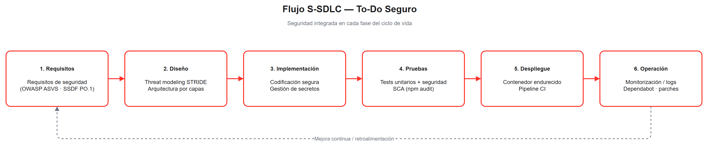
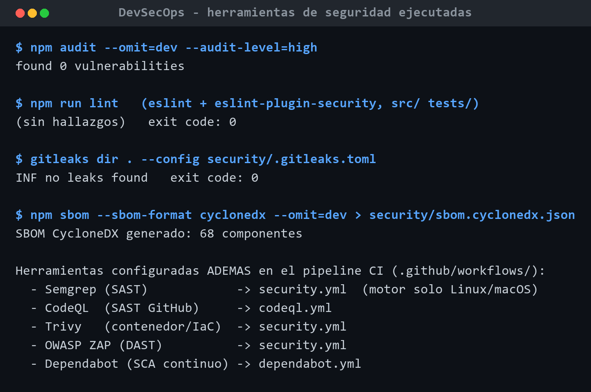
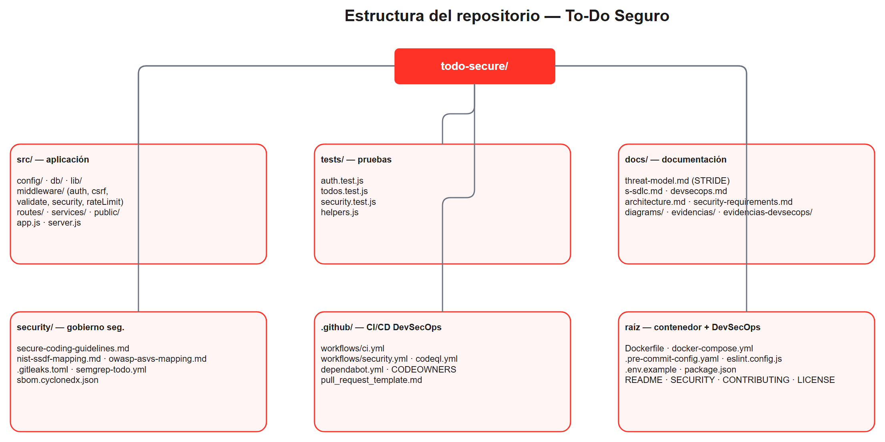

<p align="center">
  
</p>

<h1 align="center">To-Do Seguro — S-SDLC + DevSecOps</h1>

<p align="center">
  Aplicación web <em>to-do</em> contenerizada, con seguridad integrada en el ciclo de vida
  (<strong>S-SDLC</strong>) y <strong>automatizada con DevSecOps</strong>.
</p>

<p align="center">
  <strong>Asignatura:</strong> Metodologías de Desarrollo Seguro ·
  Grado en Ingeniería de la Ciberseguridad<br/>
  <strong>Universidad Europea de Madrid</strong> · Curso 2025/2026 ·
  <strong>Unidad 3 (Actividad 2)</strong><br/>
  <strong>Estudiante:</strong> Salma Gamal · <strong>Profesor:</strong> Sergio Iglesias Pérez
</p>

---

## Autoría y continuidad

- **Trabajo individual** realizado por **Salma Gamal**. La actividad está planteada para
  grupos; al realizarse de forma individual, el "equipo" lo compone una única integrante y
  no procede la unificación de varias aplicaciones: se parte de la propia.
- **Actividad anterior (Unidad 2 / Actividad 1):** esta entrega es una **continuación** del
  proyecto creado en la actividad previa, al que añade la capa DevSecOps.
  - 🔗 Repositorio de la actividad anterior: **<https://github.com/gamal-salma/todo-secure>**

---

## Índice

1. [Definición de la aplicación y cómo ejecutarla](#1-definición-de-la-aplicación-y-cómo-ejecutarla-a)
2. [Consideraciones de seguridad del diseño](#2-consideraciones-de-seguridad-del-diseño-b)
3. [Paso a paso: S-SDLC y DevSecOps](#3-paso-a-paso-s-sdlc-y-devsecops-c)
4. [DevSecOps: pipeline, puertas y evidencias](#4-devsecops-pipeline-puertas-y-evidencias)
5. [Estructura del proyecto](#5-estructura-del-proyecto)
6. [Pruebas y herramientas de seguridad](#6-pruebas-y-herramientas-de-seguridad)
7. [Estándares y referencias](#7-estándares-y-referencias)
8. [Declaración de uso de IA](#8-declaración-de-uso-de-ia)

---

## 1. Definición de la aplicación y cómo ejecutarla (a)

### ¿Qué es?

**To-Do Seguro** es una aplicación web de **lista de tareas** (referencia: el tutorial de
Docker) reconstruida con seguridad desde el diseño. Permite registrarse, iniciar sesión y
gestionar **tus** tareas (cada usuario solo ve las suyas). Pila: **Node.js 24 + Express +
SQLite (`node:sqlite`)**, contenerizada con Docker. Se eligió una **web-app** porque las
unidades posteriores la reutilizan.

### Ejecución con Docker (un solo comando)

```bash
cp .env.example .env     # define SESSION_SECRET con un valor aleatorio:
#   node -e "console.log(require('crypto').randomBytes(48).toString('hex'))"
docker compose up --build
```
Disponible en **<http://localhost:3000>**. Para detener: `docker compose down`.

### Ejecución local (Node ≥ 22.5)

```bash
cp .env.example .env
npm install
npm start          # o: npm run dev
```

### Comprobación rápida

```text
$ curl http://localhost:3000/api/health
{"status":"ok"}
```

---

## 2. Consideraciones de seguridad del diseño (b)

La seguridad se diseñó **antes de codificar** mediante un **modelo de amenazas STRIDE** del
to-do. Resumen (detalle completo en [`docs/threat-model.md`](docs/threat-model.md)):

| Riesgo (OWASP) | Mitigación en el to-do | Dónde |
|----------------|------------------------|-------|
| A01 Broken Access Control / IDOR | `requireAuth` deny-by-default + filtro por `user_id` | `middleware/auth.js`, `services/todo.service.js` |
| A02 Cryptographic Failures | bcrypt (coste 12), cookie firmada, HSTS en prod | `services/user.service.js`, `app.js` |
| A03 Injection (SQLi/XSS) | Sentencias preparadas + `textContent` + CSP estricta | `db/`, `public/app.js`, `middleware/security.js` |
| A05 Misconfiguration | Helmet, `x-powered-by` off, errores sin detalle | `middleware/security.js`, `errorHandler.js` |
| A07 Auth Failures | Rate limiting, anti-fixation, anti-enumeración | `middleware/rateLimit.js`, `auth.routes.js` |
| Gestión de secretos | `.env` fuera del repo + *fail-fast* en prod | `config/index.js` |
| A09 Logging | Logging estructurado con redacción | `lib/logger.js` |

Estas decisiones se **verifican** automáticamente en `tests/security.test.js` (cabeceras,
401, IDOR, CSRF, SQLi, XSS, rate limit) — **15/15 pruebas en verde**.

---

## 3. Paso a paso: S-SDLC y DevSecOps (c)

El proyecto integra seguridad en **cada fase del S-SDLC** y la **automatiza** con DevSecOps.



1. **Requisitos.** Requisitos de seguridad (OWASP ASVS, NIST SSDF PO.1) →
   `docs/security-requirements.md`.
2. **Diseño.** Modelado de amenazas **STRIDE** y arquitectura por capas →
   `docs/threat-model.md`, `docs/architecture.md`.
3. **Implementación.** Codificación segura: validación, consultas parametrizadas, bcrypt,
   sesión endurecida, CSRF, CSP, gestión de secretos, logging → `src/`.
4. **Pruebas.** Unitarias + de seguridad + SAST/SCA → `tests/`, pipeline.
5. **Despliegue.** Contenedor endurecido + pipeline CI/CD → `Dockerfile`, `.github/`.
6. **Operación.** Monitorización, Dependabot, divulgación responsable → `SECURITY.md`.

**DevSecOps** convierte ese ciclo en un flujo **continuo y automatizado** (siguiente
sección). El detalle está en [`docs/devsecops.md`](docs/devsecops.md).

---

## 4. DevSecOps: pipeline, puertas y evidencias

Seguridad **como código**: las políticas y escaneos viven en el repositorio y se ejecutan
en cada *push*/PR. El ciclo **Plan → Code → Build → Test → Release → Deploy → Operate →
Monitor** incorpora una herramienta de seguridad en cada etapa:


### Puertas de seguridad (quality gates) del pipeline

| Etapa | Técnica | Herramienta | Fichero |
|-------|---------|-------------|---------|
| Code | Secretos (pre-commit) | gitleaks | `.pre-commit-config.yaml`, `security/.gitleaks.toml` |
| Code/Test | SAST | ESLint security · **Semgrep** · **CodeQL** | `eslint.config.js`, `security/semgrep-todo.yml`, `.github/workflows/` |
| Build | Procedencia (SBOM) | `npm sbom` (CycloneDX) | `security/sbom.cyclonedx.json` |
| Release | SCA | `npm audit` · Dependabot | `.github/workflows/`, `dependabot.yml` |
| Deploy | Contenedor / IaC | **Trivy** | `.github/workflows/security.yml` |
| Monitor | DAST | **OWASP ZAP** baseline | `.github/workflows/security.yml` |

> El pipeline **rompe el build** ante hallazgos críticos (SCA alta/crítica, secretos,
> vulnerabilidades de imagen). Semgrep incluye **reglas propias adaptadas a la app**
> (`security/semgrep-todo.yml`) que detectan `innerHTML`, SQL por concatenación y secretos
> hardcodeados.

### Evidencias reales (ejecutadas en local)

Salida real de las herramientas que corren en Windows (el resto se ejecuta en CI):



`npm audit` → **0 vulnerabilidades** · ESLint security → **sin hallazgos** · gitleaks →
**no leaks found** · SBOM → **68 componentes**. Salidas íntegras en
[`docs/evidencias-devsecops/`](docs/evidencias-devsecops/).

---

## 5. Estructura del proyecto



```text
todo-secure/
├── src/                      # Aplicación (config, db, lib, middleware, routes, services, public)
├── tests/                    # node:test + supertest (incl. security.test.js)
├── docs/                     # threat-model · s-sdlc · devsecops · architecture · diagrams · evidencias
├── security/                 # guías, mapeos SSDF/ASVS, gitleaks, semgrep-todo, SBOM
├── .github/workflows/        # ci.yml · security.yml (SAST/SCA/secrets/Trivy/ZAP) · codeql.yml
├── .pre-commit-config.yaml   # hooks shift-left (gitleaks, higiene)
├── eslint.config.js          # SAST ligero (eslint-plugin-security)
├── Dockerfile · docker-compose.yml
└── README · SECURITY · CONTRIBUTING · LICENSE
```

---

## 6. Pruebas y herramientas de seguridad

```bash
npm test            # unitarias + seguridad (15/15)
npm run lint        # ESLint + eslint-plugin-security (SAST)
npm run audit       # SCA (npm audit)
npm run sbom        # genera el SBOM CycloneDX
pre-commit run --all-files   # hooks locales (gitleaks + higiene)
```

En el pipeline (`.github/workflows/`) se ejecutan además **Semgrep**, **CodeQL**, **Trivy**
y **OWASP ZAP**. Conviene activar en GitHub *Code scanning* (CodeQL), *Dependabot alerts* y
*secret scanning* (gratuitos en repos públicos).

---

## 7. Estándares y referencias

- **Microsoft SDL** — <https://www.microsoft.com/en-us/securityengineering/sdl>
- **OWASP SAMM v2** — <https://owaspsamm.org/>
- **OWASP DSOMM** (DevSecOps Maturity Model) — <https://owasp.org/www-project-devsecops-maturity-model/>
- **NIST SSDF — SP 800-218** — <https://csrc.nist.gov/pubs/sp/800/218/final>
- **OWASP Top 10 (2021)** — <https://owasp.org/Top10/>
- **OWASP ASVS v4** — <https://owasp.org/www-project-application-security-verification-standard/>

Mapeos: [`security/nist-ssdf-mapping.md`](security/nist-ssdf-mapping.md) ·
[`security/owasp-asvs-mapping.md`](security/owasp-asvs-mapping.md).

---

## 8. Declaración de uso de IA

Para esta entrega se utilizó un asistente de IA (**Claude, de Anthropic**) como apoyo, bajo
supervisión y revisión humana.

**Generado con apoyo de IA:** andamiaje del pipeline DevSecOps (workflows de CI, reglas
Semgrep/ESLint, pre-commit), el documento `docs/devsecops.md`, el diagrama del ciclo y la
redacción del README.

**Revisado y validado (supervisión humana):**
- Se **ejecutaron realmente** las herramientas: `npm audit` (0 vulnerabilidades), ESLint
  security (sin hallazgos), gitleaks (*no leaks found*) y generación del SBOM; tests 15/15.
- Durante la verificación se detectaron y corrigieron **problemas reales**: (1) Semgrep no
  se ejecuta de forma nativa en Windows → se añadió ESLint security como SAST local y
  Semgrep queda en CI; (2) gitleaks marcaba falsos positivos de `node_modules` y de su
  propio README → se **trió** la allowlist con patrones multiplataforma hasta dejar el
  escaneo limpio; (3) se triaron dos *warnings* de ESLint sobre acceso a ficheros con ruta
  controlada por configuración, documentando el motivo.
- Se comprobó que cada decisión está justificada y adaptada a esta app to-do, y que no hay
  secretos en el repositorio.

La autora asume la responsabilidad final sobre el contenido y su adecuación a la actividad.

---

<p align="center"><sub>
Metodologías de Desarrollo Seguro · Universidad Europea de Madrid · 2025/2026
</sub></p>
