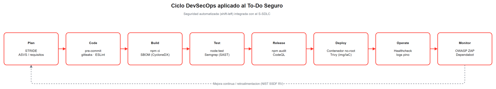

# DevSecOps en el To-Do Seguro

> **Actividad de la Unidad 3.** Este documento demuestra y describe cómo se aplica
> **DevSecOps** en la creación de la aplicación to-do, ampliando el S-SDLC documentado en
> la Unidad 2 con **automatización de la seguridad como código** y cultura *shift-left*.

## 1. ¿Qué añade DevSecOps al S-SDLC?

El S-SDLC define *qué* controles de seguridad aplicar en cada fase (requisitos, diseño,
implementación, pruebas, despliegue, operación). **DevSecOps** lo lleva a la práctica de
forma **continua y automatizada**, integrando esos controles en el ciclo
**Plan → Code → Build → Test → Release → Deploy → Operate → Monitor** y haciendo que la
seguridad sea responsabilidad de todo el flujo, no una fase final.

Tres principios que aplicamos a la app to-do:
- **Shift-left:** detectar los problemas lo antes posible (en el editor y en el commit),
  donde corregirlos es más barato.
- **Seguridad como código:** las políticas y los escaneos viven en el repositorio
  (`.github/workflows/`, `.gitleaks.toml`, `semgrep-todo.yml`, `.pre-commit-config.yaml`)
  y se versionan y revisan como cualquier otro código.
- **Quality gates automáticos:** el pipeline **rompe el build** si una comprobación
  crítica falla, impidiendo que el problema avance.

## 2. El ciclo DevSecOps aplicado a la app to-do

| Etapa | Control de seguridad | Herramienta / artefacto | Fase S-SDLC equivalente |
|-------|----------------------|-------------------------|-------------------------|
| **Plan** | Modelado de amenazas STRIDE, requisitos ASVS | `docs/threat-model.md`, `docs/security-requirements.md` | Requisitos / Diseño |
| **Code** | Escaneo de secretos y *linting* de seguridad antes del commit | `pre-commit` + gitleaks, ESLint security | Implementación |
| **Build** | Build reproducible y procedencia (SBOM) | `npm ci` + `npm sbom` (CycloneDX) | Implementación |
| **Test** | Pruebas unitarias + de seguridad, SAST | `node:test`, Semgrep, CodeQL | Pruebas |
| **Release** | SCA y escaneo de la imagen del contenedor | `npm audit`, Trivy | Pruebas / Despliegue |
| **Deploy** | Contenedor endurecido, escaneo de IaC | Dockerfile no-root + `docker-compose`, Trivy config | Despliegue |
| **Operate** | Salud del servicio y logging | `HEALTHCHECK`, logs pino | Operación |
| **Monitor** | DAST y gestión continua de vulnerabilidades | OWASP ZAP, Dependabot, *code scanning* | Operación / Mantenimiento |

El bucle se **retroalimenta**: los hallazgos de *Monitor* (Dependabot, ZAP, CodeQL)
generan nuevas tareas de *Plan*, cerrando el ciclo de mejora continua (NIST SSDF RV).

## 3. Las puertas de seguridad (gates) del pipeline

Definidas en `.github/workflows/`:

1. **Build & Test** (`ci.yml`): `eslint`, `npm test` (incluye `security.test.js`) y build de
   la imagen. Si un test de seguridad falla, no se sigue.
2. **SCA** (`security.yml` → job `sca`): `npm audit --audit-level=high` **rompe** ante
   dependencias con vulnerabilidades altas/críticas. Genera el **SBOM** CycloneDX.
3. **SAST** (`security.yml` → `sast` + `codeql.yml`): **Semgrep** (reglas OWASP/Node +
   reglas propias `security/semgrep-todo.yml`) y **CodeQL**; suben resultados SARIF a
   *Code scanning*.
4. **Secretos** (`security.yml` → `secrets`): **gitleaks** con `security/.gitleaks.toml`.
5. **Contenedor / IaC** (`security.yml` → `container`): **Trivy** escanea la imagen
   (vulnerabilidades) y la configuración (Dockerfile/compose).
6. **DAST** (`security.yml` → `dast`): **OWASP ZAP baseline** contra la app levantada en un
   contenedor.

Complementos continuos: **Dependabot** (`.github/dependabot.yml`) abre PRs de parches, y
**CODEOWNERS** exige revisión humana de los cambios sensibles.

## 4. Por qué estas herramientas para ESTA app

- **gitleaks / pre-commit:** la app gestiona un `SESSION_SECRET`; evitar que un secreto se
  versione es la prioridad nº 1 de la cadena de suministro (NIST SSDF PS.1).
- **Semgrep + reglas propias:** codificamos como política los antipatrones que la app evita
  (`innerHTML` → XSS, SQL por concatenación → SQLi, secretos hardcodeados). Así, si una
  futura contribución los reintroduce, el pipeline lo detecta.
- **ESLint security:** SAST ligero ejecutable también en local/Windows (el motor de Semgrep
  es solo Linux/macOS), para no dejar al desarrollador sin red en su máquina.
- **Trivy:** la app se entrega como contenedor; escanear imagen e IaC cierra el riesgo de
  A06 (componentes vulnerables) y A05 (mala configuración).
- **OWASP ZAP:** valida en caliente las cabeceras y comportamientos (CSP, cookies) que el
  S-SDLC definió en diseño.

## 5. Evidencias

Resultados reales de ejecutar las herramientas localmente (las que corren en Windows) en
`docs/evidencias-devsecops/`: `npm audit` (0 vulnerabilidades), ESLint security (sin
hallazgos), gitleaks (*no leaks found*) y el **SBOM** en `security/sbom.cyclonedx.json`.
El resto (Semgrep, CodeQL, Trivy, ZAP) se ejecuta en el pipeline de CI al hacer *push*.
