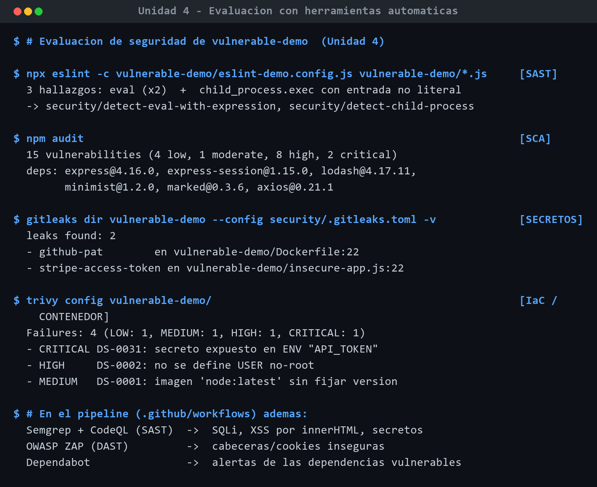

# Informe de evaluación de seguridad con herramientas automáticas

> **Actividad de la Unidad 4.** Evaluación de la seguridad del código del proyecto to-do
> mediante herramientas automáticas. Se han seleccionado y **ejecutado realmente** más de
> cinco técnicas/herramientas de categorías distintas. Para provocar alertas, se ha creado
> una copia **deliberadamente vulnerable** de la aplicación en
> [`vulnerable-demo/`](../vulnerable-demo/), manteniendo intacta la versión segura (`src/`).

## 1. Herramientas/técnicas seleccionadas y por qué

| # | Técnica | Herramienta | Por qué es relevante para esta app |
|---|---------|-------------|------------------------------------|
| 1 | **SCA** (dependencias) | `npm audit` (+ Dependabot) | La app vive del ecosistema npm; detectar CVEs en dependencias es prioritario (A06). |
| 2 | **SAST** (estático) | ESLint + eslint-plugin-security | Detecta patrones peligrosos de Node (eval, child_process) en local y en CI. |
| 3 | **SAST** (estático) | **Semgrep** + **CodeQL** | Reglas OWASP + reglas propias (SQLi, XSS por innerHTML, secretos); CodeQL es gratis en GitHub. |
| 4 | **Secret scanning** | gitleaks (+ secret scanning de GitHub) | La app maneja `SESSION_SECRET`; evitar secretos versionados es crítico (A05/PS.1). |
| 5 | **Contenedor / IaC** | Trivy | La app se entrega como contenedor; escanea imagen y configuración (A05/A06). |
| 6 | **DAST** (dinámico) | OWASP ZAP baseline | Valida en caliente cabeceras y cookies sobre la app en marcha (A05). |

> Las herramientas 2-6 ya estaban integradas en el **pipeline DevSecOps** de la Unidad 3
> (`.github/workflows/`). Esta actividad las **ejecuta y documenta** contra la versión
> vulnerable para observar sus alertas.

## 2. Metodología

- La carpeta `vulnerable-demo/` contiene código y configuración inseguros **a propósito**.
- Las herramientas que se ejecutan de forma nativa en Windows (npm audit, ESLint, gitleaks,
  Trivy) se ejecutaron en local; las que requieren Linux/contenedor (Semgrep, CodeQL, ZAP)
  se ejecutan en el pipeline de CI sobre la rama correspondiente.
- Salidas completas en [`docs/evidencias-herramientas/`](evidencias-herramientas/).

## 3. Resultados (reales)

### 3.1 SCA — `npm audit`
**15 vulnerabilidades: 2 críticas, 8 altas, 1 moderada, 4 bajas**, procedentes de las
dependencias fijadas con versiones vulnerables (`lodash@4.17.11`, `minimist@1.2.0`,
`marked@0.3.6`, `axios@0.21.1`, `express@4.16.0`, `express-session@1.15.0`).
Fichero: `docs/evidencias-herramientas/02-npm-audit.txt`.

### 3.2 SAST — ESLint security
**3 hallazgos**: `eval` con expresión (x2) y `child_process.exec` con argumento no literal.
Reglas: `security/detect-eval-with-expression`, `security/detect-child-process`.
Fichero: `docs/evidencias-herramientas/01-eslint-sast.txt`.

### 3.3 Secret scanning — gitleaks
**2 secretos**: un *GitHub PAT* en `vulnerable-demo/Dockerfile:22` y un *Stripe token* en
`vulnerable-demo/insecure-app.js:22`.
Fichero: `docs/evidencias-herramientas/03-gitleaks-secrets.txt`.

### 3.4 Contenedor/IaC — Trivy (config)
**4 *misconfigurations***: 1 CRÍTICA (secreto en `ENV API_TOKEN`), 1 ALTA (sin usuario
no-root), 1 MEDIA (imagen `node:latest` sin fijar), 1 BAJA.
Fichero: `docs/evidencias-herramientas/04-trivy-config.txt`.

### 3.5 SAST en CI — Semgrep / CodeQL
Las reglas propias `security/semgrep-todo.yml` detectan el `innerHTML` y la **SQLi por
concatenación**; CodeQL (gratuito en GitHub) reporta la inyección en la pestaña
*Security > Code scanning*.

### 3.6 DAST en CI — OWASP ZAP
ZAP baseline señala la ausencia de cabeceras seguras y la cookie de sesión sin `HttpOnly`/
`Secure` del demo inseguro.

## 4. Alteraciones introducidas (lista y justificación)

| # | Alteración (fichero:línea) | Por qué se hizo | Efecto esperado | Hallazgo obtenido | OWASP / CWE |
|---|----------------------------|-----------------|-----------------|-------------------|-------------|
| 1 | `insecure-app.js:25` — query SQL por concatenación | Provocar SQLi | Alerta SAST | Semgrep/CodeQL: SQLi | A03 / CWE-89 |
| 2 | `insecure-app.js:40` — `eval(req.body.expr)` | Ejecución de código | Alerta SAST | ESLint: detect-eval | A03 / CWE-95 |
| 3 | `insecure-app.js:46` — `child_process.exec` con input | Command injection | Alerta SAST | ESLint: detect-child-process | A03 / CWE-78 |
| 4 | `insecure-app.js:22` — token Stripe hardcodeado | Secreto en código | Alerta de secretos | gitleaks: stripe-access-token | A05 / CWE-798 |
| 5 | `insecure-app.js:53` — MD5 / `Math.random` | Cripto débil | Alerta SAST | Semgrep | A02 / CWE-327/330 |
| 6 | `insecure-frontend.js:11` — `innerHTML` con dato de usuario | Provocar XSS | Alerta SAST (regla propia) | Semgrep: todo-no-innerhtml | A03 / CWE-79 |
| 7 | `Dockerfile:8/12/22` — `latest`, root, secreto en ENV | Mala config de contenedor | Alerta IaC | Trivy: CRIT/HIGH/MED | A05 / CWE-250/798/1104 |
| 8 | `package.json` — deps con CVE conocidos | Dependencias vulnerables | Alerta SCA | npm audit: 15 vulns | A06 |

## 5. Remediación (cómo lo resuelve la versión segura)

Cada alteración tiene su contrapartida **ya implementada** en la app segura (`src/`):

- **SQLi** → sentencias preparadas parametrizadas (`src/db/`, `src/services/`).
- **XSS** → `textContent` + CSP estricta (`src/public/app.js`, `src/middleware/security.js`).
- **eval / command injection** → no se usan; entrada validada (`src/middleware/validate.js`).
- **Secretos** → variables de entorno + *fail-fast* (`src/config/index.js`), nunca en código.
- **Cripto** → bcrypt para contraseñas, `crypto.randomBytes` para tokens.
- **Contenedor** → imagen fijada, usuario no-root, sin secretos en la imagen (`Dockerfile`).
- **Dependencias** → versiones al día, `npm audit` y Dependabot en CI.

## 6. Herramientas gratuitas de GitHub utilizadas

- **CodeQL** (`.github/workflows/codeql.yml`) — *code scanning*.
- **Dependabot** (`.github/dependabot.yml`) — alertas y PRs de actualización.
- **Secret scanning** — nativo de GitHub en repositorios públicos.
